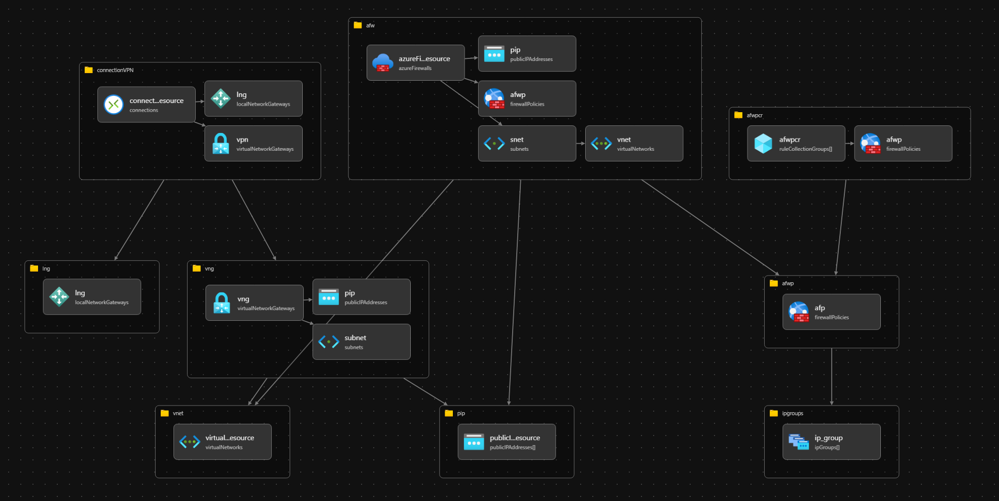

# Introducción

Este proyecto ayuda en la automatización de la infraestructura utilizada por Compensar.

## Arquitectura actual de referencia



### Pre Requesitos

Azure CLI
Bicep

### Despliegue

```powershell
az group create --name rg-platfr-secuty-public-trv-i --location "eastus"

az deployment group create --resource-group rg-platfr-secuty-public-trv-i --template-file "main.bicep" --parameters "@parameters/project.parameters.json" --parameters "@parameters/afw.parameters.json" --parameters "@parameters/afwpcr.parameters.json" --parameters "@parameters/vnet.parameters.json" --parameters "@parameters/tags.parameters.json" --what-if